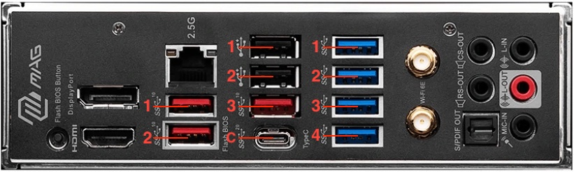

# MSI MAG B650 TOMAHAWK WIFI + AMD 7800X3D Hackintosh

# Current macOS

Current Version: macOS Ventura 13.6.3

# Hardware
| Type | Model                |
| :-------- | :------------------------- |
| **CPU** | AMD Ryzen 7 7800X3D |
| **Motherboard** | MSI MAG B650 TOMAHAWK WIFI |
| **Memory** | 32 GB (2x16GB) Corsair DDR5 7200Mhz CL34 |
| **Graphics** | AMD Radeon RX6600XT |
| **PSU** | Corsair SF750 |
| **Wifi/Bluetooth** | Fenvi FV-HB1200 with Broadcom Chipset |

# Working
- CPU Power Management
- USB Ports
- Sleep/Wake
- Wifi/BT

# Not working
iGPU, disable this in your BIOS.

# BIOS Settings
Default settings with XMP enabled. Disable iGPU.

# USB Port Mapping

USB-Port Mapping is done via `USBPorts.kext`:

See below pictures for mapping according included kext.

